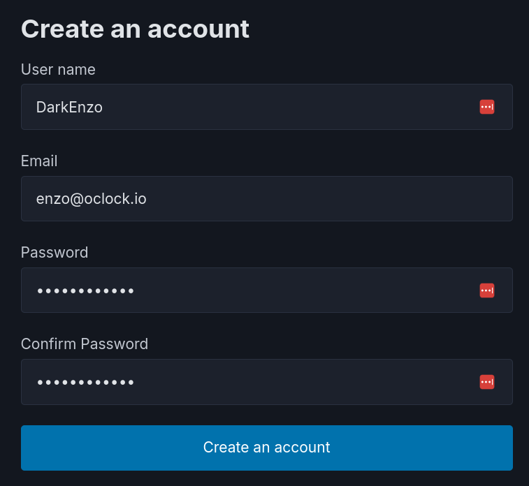
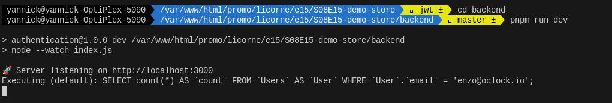
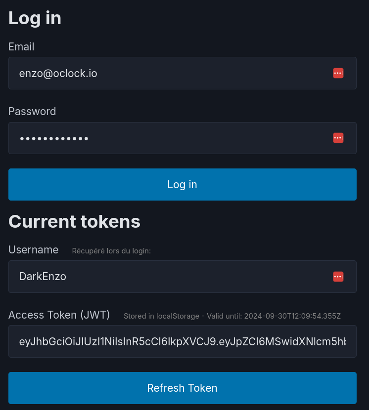
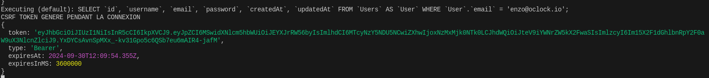
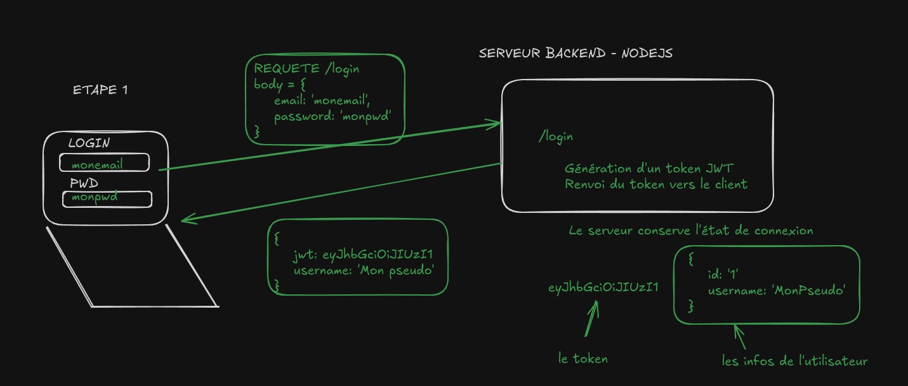
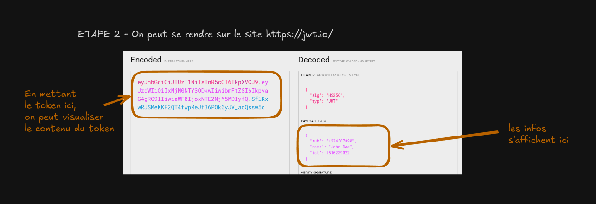
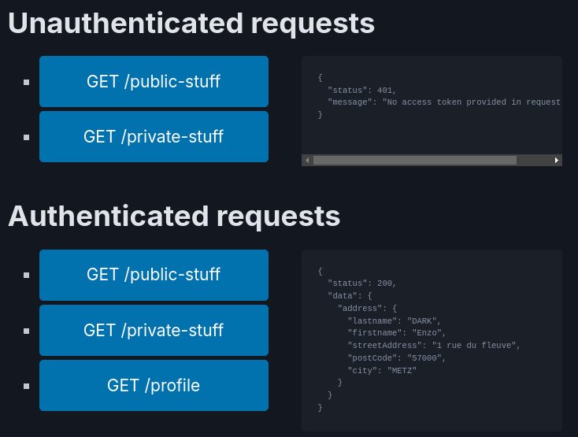
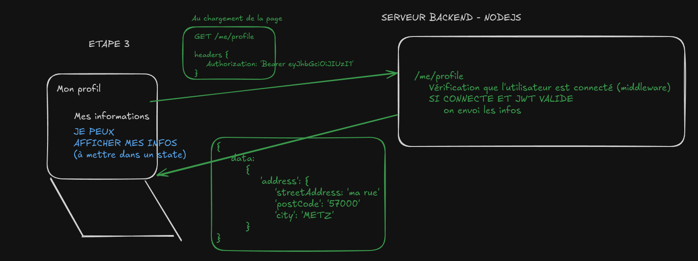
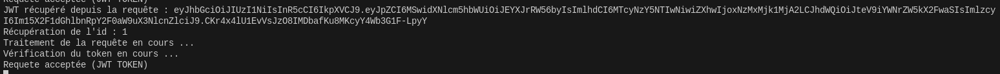

# Le retour de l'Atelier SPA (avec backend et JWT)

## Objectif de cet atelier

Aujourd'hui, votre mission, si vous l'acceptez, est de continuer l'atelier SPA pour rajouter la partie manquante, à savoir un **backend** qui vous permettra de gérer les autorisations et rajouter la partie connexion, authentification avec un token JWT.

On repart pas de zéro, tout le code de correction de la veille est accessible dans ce dépôt directement.

---

## ATELIER PARTIE 1 - TESTONS D'ABORD LE BACKEND

---

### Étape 1 : On installe le projet backend

1. Allez dans le dossier du projet :
   ```bash
   cd backend
   ```
2. Installez les dépendances :
   ```bash
   npm install
   ```
3. Création de la base de données SQLITE :
   ```bash
   npm run db:reset
   ```
4. Démarrez le serveur et voyons d'abord si le projet est fonctionnel :
   ```bash
   npm run dev
   ```

Allez dans votre navigateur à `http://localhost:3000/`, pour vérifier qu'on a bien accès à une page HTML (interface pour tester le backend). Cet écran permet une simulation du backend avec du JS Vanilla. 

---

### Étape 2 : On commence par l'insertion d'un compte dans la base de données

Cliquez d'abord sur le bouton **Create an account**. Cela permettra d'insérer un compte dans la base de données.



Dans le terminal, on pourra voir la requête s'insérer.



### Étape 3 : On teste la partie login

Cliquez sur le bouton **Log in**. Cela permettra de lancer un appel GET /login vers le serveur **Node**.



On voit que la partie **username** et **access token** se complète après avoir cliqué sur le bouton. Ce sont les informations que le backend envoi au frontend après la phase de login.

On peut visualiser également le token généré par le serveur. Il s'agit d'un token (une clé) JWT (Json Web Token).



Voyons un schéma permettant de récapituler le flux de données.



- La phase de connexion nous permet d'indiquer notre email et mot de passe pour se connecter au site.
- La phase d'authentification nous permet d'avoir un moyen de rester connecté.

Comme nous utilisons ici un projet full stack (React + Node), nous ne pouvons pas passer par le système de SESSIONS (cookies). Ce token JWT est généré par le backend uniquement pendant la phase de connexion.

Dans un projet React, il faudra conserver ce token dans le **local Storage** par exemple (réponse du login), pour le présenter au backend dès qu'on aura besoin d'accéder à des informations sensibles (on verra ça dans la pratique).

On peut également visualiser ce JWT grâce au site [jwt.io](https://jwt.io). Il suffit de copier le token généré dans le cadre de gauche pour obtenir ces informations.



### Étape 4 : Vérifions qu'on accède au profil



- Cliquez sur le bouton **Unauthenticated requests (requête sans authentification)/GET /private-stuff**
- Cliquez sur le bouton **Authenticated requests (requête avec authentification)/GET /profile**

La première requête affiche une erreur 401 (no access token provided), ce qui signifie qu'aucun token n'a été présenté et qu'on aura donc pas accès aux informations sensibles. Le client dans ce cas n'a pas présenté le token JWT lors de la requête.

La deuxième requête affiche les informations, avec un statut HTTP 200. Dans ce dernier cas, le client a présenté le JWT et a bien eu accès aux informations de son profil.

Un petit schéma pour résumer le flux des données.



Constatez sur le schéma la requête GET /me/profile, dans laquelle on va passer une clé `Authorization: Bearer < contenu JWT >` et qui va permettre au backend de vérifier si on peut ou non accéder aux données sensibles.

On peut voir également le traitement du JWT côté backend.



N'hésitez pas à analyser le code du backend pour mieux comprendre la logique. (j'ai laissé des commentaires **ETAPE 1**, 2, 3, etc. pour vous aider à vous repérer).

### Étape 5 : Résumons

Pour s'authentifier et s'identifier dans une application React/Vanilla JS ou autre :

- On se connecte avec une requête POST /login, le backend nous envoi un token JWT, à stocker par exemple dans le localStorage ou le state
- A chaque requête où on va avoir besoin d'une autorisation (POST, GET, PUT, DELETE) sur des données sensibles, on va faire la requête en lui passant le contenu du token JWT (qu'on a stocké pendant la phase de login)
- On supprime le JWT dans le localStorage ou le state dès qu'on se logout

### Étape 6 : La pratique

Allons sur la partie numéro 2 pour mettre en pratique cela dans notre application React.

Let's go ! Cliquez sur le lien pour y aller : [partie 2](PARTIE2.md)


